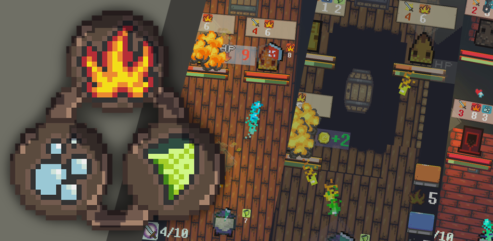
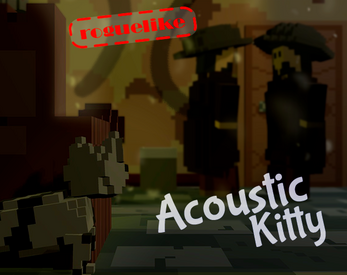
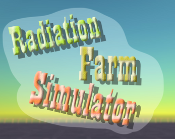

# Онлайн портфолио

## Мои навыки в **С#** и **Unity**

1. Понимание концепции ООП и SOLID принципов
2. Умею разделять приложение на слои, используя интерфейсы
3. Знание и умении применять популярные паттерны 
4. Знание стандартных инструментов юнити 
   *. аниматор 
   *. работа с анимации 
   *. создание простых эффектов через партикел систем
   *. верстка UI
   *. Работа со светом
   *. спрайты, модели, материалы, шейдеры
5. Опыт работы со стороними ассетами - 
   *. Appodel - реклама
   *. DoTween - анимация через код
   *. Bézier Path Creator - бизье кривые в юнит
   *. InterfaceRequareAtribute - ассет позволяющий инспектору юнити обрабатывать интерфейсы через box и unbox. (код атрибута)

## Готовые игры на itch или в маркете

### [Dungeon of Element](https://play.google.com/store/apps/details?id=com.Ma0ooDev.com.unity.Dungeon.of.Element) - Play Market

### [Acoustic Kitty (itch)](https://happymao.itch.io/acoustic-kitty) - itch

### [Radioactive farm simulator - Prototype](https://happymao.itch.io/radioactive7farm7simulator) - itch

